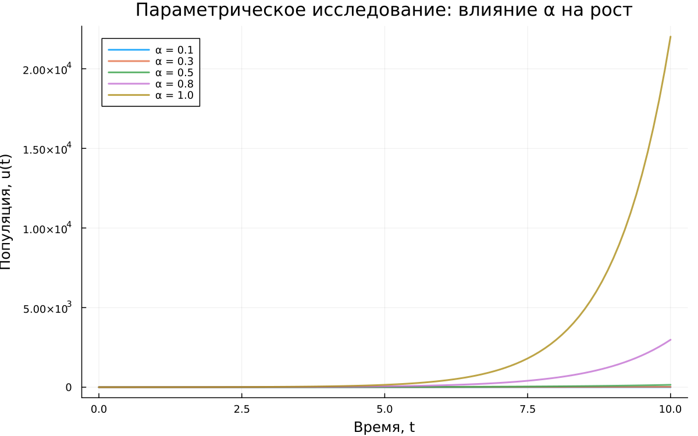
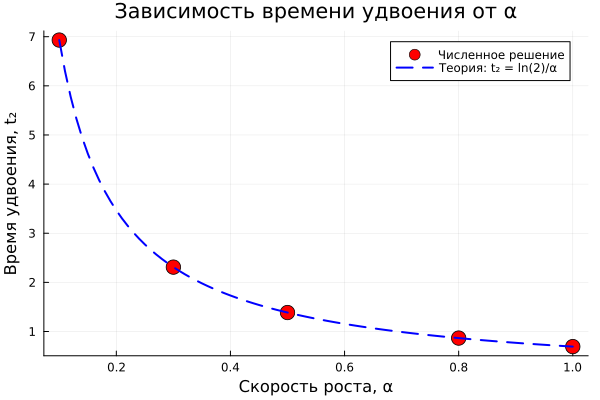

---
## Author
author:
  name: Юрченко Артём Алексеевич
  email: 1132249525@rudn.ru
  affiliation:
    - name: Российский университет дружбы народов
      country: Российская Федерация
      postal-code: 117198
      city: Москва
      address: ул. Миклухо-Маклая, д. 6
## Title
title: Лабораторная работа № 1
subtitle: Подготовка стенда
license: CC BY
date: today
date-format: "DD.MM.YYYY"
---

## Докладчик

:::::::::::::: {.columns align=center}
::: {.column width="70%"}

  * Юрченко Артём Алексеевич
  * студ. билет: 1132249525

:::
::: {.column width="30%"}

:::
::::::::::::::

## Цель работы

- Подготовка рабочего окружения
- Освоение инструментов:
  - Git, GitFlow
  - Julia, DrWatson
  - Quarto, Jupyter

---

## Что было сделано

- Настроены Git, SSH, репозитории
- Создан проект DrWatson
- Реализована математическая модель
- Проведены вычисления и анализ

---

## Модель

$$
\frac{du}{dt} = \alpha u
$$

$$
u(t) = u_0 e^{\alpha t}
$$

- $u_0 = 1$
- $\alpha = 0.3$
- $t \in [0,10]$

---

## Результат (базовый случай)

- Рост экспоненциальный
- $u(10) \approx 20$
- $T_2 \approx 2.31$

{width=70%}

---

## Влияние параметра α

- При увеличении $\alpha$ рост ускоряется
- Время удвоения уменьшается

{width=70%}

---

## Время удвоения

$$
T_2 = \frac{\ln 2}{\alpha}
$$

{width=70%}

---

## Выводы

В ходе лабораторной работы:

- подготовлено рабочее окружение для дальнейших лабораторных работ
- освоены Git, Julia, DrWatson, Quarto и Jupyter
- реализована модель экспоненциального роста
- выполнено параметрическое исследование по различным значениям $\alpha$
- сохранены результаты вычислений, таблицы и графики
