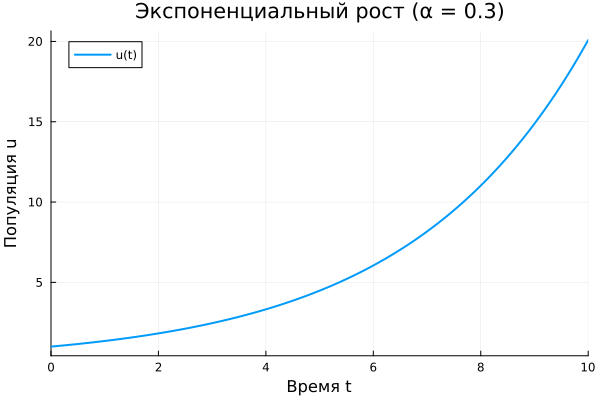

---
## Author
author:
  name: Юрченко Артём Алексеевич
  Ст/Б: 1132249525
  email: 1032259387@rudn.ru
  affiliation:
    - name: Российский университет дружбы народов
      country: Российская Федерация
      postal-code: 117198
      city: Москва
      address: ул. Миклухо-Маклая, д. 6

## Title
title: "Отчёт по лабораторной работе № 1"
subtitle: "Подготовка стенда"
license: "CC BY"
---

# Цель работы

Подготовить рабочее окружение для выполнения лабораторных работ по курсу "Методы математического моделирования в кибербезопасности". Освоить инструменты для разработки научных проектов: Git, Julia, DrWatson, Quarto, Jupyter.

# Задание

- Создать рабочий каталог для всего курса.
- Создать рабочее пространство для программ в рамках лабораторной работы.
- Выполнить все задания по тексту лабораторной работы.
- Установить необходимые пакеты.
- Выполнить предложенный код.
- Преобразовать код в литературный стиль.
- Сгенерировать из литературного кода:
	--  чистый код;
	-- jupyter notebook;
	-- документацию в формате Quarto.
- Выполнить код из jupyter notebook.
- Интегрировать документацию в формате Quarto в отчёт.
- Добавить в код в литературном стиле вычисление для набора параметров.
- Сгенерировать из литературного кода с параметрами:
	-- чистый код;
	-- jupyter notebook;
	-- документацию в формате Quarto.
- Выполнить код из jupyter notebook с параметрами.
- Интегрировать документацию с параметрами в формате Quarto в отчёт.

# Теоретическое введение

Модель экспоненциального роста описывает процесс увеличения величины, при котором скорость роста пропорциональна текущему значению. Дифференциальное уравнение модели:

$$\frac{du}{dt} = \alpha u$$

где $u$ — текущее значение величины, $t$ — время, $\alpha$ — константа роста. Решение уравнения:

$$u(t) = u_0 e^{\alpha t}$$

Время удвоения величины определяется формулой:

$$T_2 = \frac{\ln(2)}{\alpha}$$

# Выполнение лабораторной работы

## Установка программного обеспечения

## Настройка git

Выполнена базовая настройка git: имя пользователя, email, параметры переноса строк. Созданы SSH-ключи для авторизации на Gitverse и GitHub.

## Создание репозитория

Репозиторий курса создан на основе шаблона на Gitverse с названием `2026-1--study--security-modeling` и продублирован на GitHub. Настроен git flow, создан первый релиз версии 1.0.0.

## Проект DrWatson

В папке `labs/lab01` создан проект DrWatson со стандартной структурой каталогов: `data/`, `scripts/`, `plots/`, `src/`. Установлены необходимые пакеты Julia: DrWatson, DifferentialEquations, Plots, DataFrames, JLD2, Literate, IJulia, BenchmarkTools.

## Модель экспоненциального роста

Реализована модель экспоненциального роста в файле `scripts/01_exponential_growth.jl`. Код оформлен в литературном стиле с использованием Literate.jl. Начальные параметры модели: $u_0 = 1.0$, $\alpha = 0.3$, временной интервал $t \in [0, 10]$.

Результат выполнения скрипта показан на рисунке [-@fig-001].

{#fig-001 width=70%}

Аналитическое время удвоения: $T_2 = \ln(2)/0.3 \approx 2.31$.

## Генерация производных форматов

С помощью скрипта `tangle.jl` из литературного кода сгенерированы три формата:

- Чистый скрипт `.jl`
- Quarto-документ `.qmd`
- Jupyter notebook `.ipynb`

Jupyter notebook успешно выполнен в браузере.





# Выводы

В ходе лабораторной работы было подготовлено рабочее окружение для курса математического моделирования в кибербезопасности:

- Установлены и настроены Git, Julia, Quarto, Jupyter, Node.js
- Созданы SSH-ключи и настроена авторизация на Gitverse и GitHub
- Создан репозиторий курса на основе шаблона, настроен git flow
- Создан проект DrWatson для организации лабораторной работы
- Реализована модель экспоненциального роста на языке Julia
- Код оформлен в литературном стиле и преобразован в форматы Jupyter notebook и Quarto
- Проведено параметрическое исследование модели при различных значениях параметра роста $\alpha$
